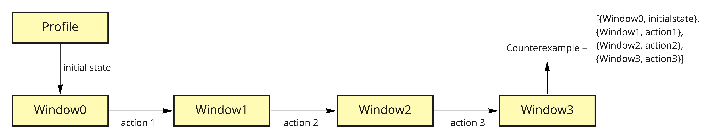

# Model Evaluator

Model Evaluator is a tool that automatically:
-	analyses formal models for browsers written in Alloy, 
-	creates test cases from counterexamples(if any) found in model checking,
-	and creates web applications that will apply the found test cases using an automated browser testing platform e.g., Browserstack.

## System Components

The Model Evaluator is a java application and the components depicted in the image below. It consists of Profiles, Alloy Execution, Parser, Test Generator and Action Invoker modules:
-	The evaluation starts with Alloy Execution module that will run a selected predicate in the Alloy model for a selected profile that consists of e.g., operating system, browser vendor and version settings. The Alloy model is defined as a transition system that consists of states(browser windows) and transitions between those states, and the predicate returns a counterexample that describes the actions to achieve the counterexample with an ordered sequence of states and the transitions between them. 

-	The Parser module parses the counterexample and creates a list of transactions for the java application.
-	The Test Generator module creates a web application and inserts each transaction as an effectuating javascript function to the web application.
-	Then, the Action Invoker module tests the web application on Browserstack using the same profile settings selected for the Alloy Execution module.


## Build and Run the Application

In order to build and run the application a JDK should be installed on the computer and Ant should be available on the terminal.

```
brew install ant 

```

For building the application, go to the application directory and run:
```
ant build

```

For running the application, use:
```
ant run -e

```
The -e argument is used for producing logging information without adornments.
Most of the time it is not needed but if you need to clean ant build and start from the beginning, you can run "ant clean".

### The Model Evaluator tool is fully open-source and part of a research project, and it still is under development.
It currently includes a webcam attack on Safari the attack trace can be found in https://www.ryanpickren.com/webcam-hacking.

See also 
-	Ilkan Esiyok https://cispa.de/en/people/ilkan.esiyok
-	Robert Kuennemann https://cispa.de/en/people/kuennemann/
-	Hamed Nemati https://cispa.de/en/people/hamed.nemati

for information about us.
