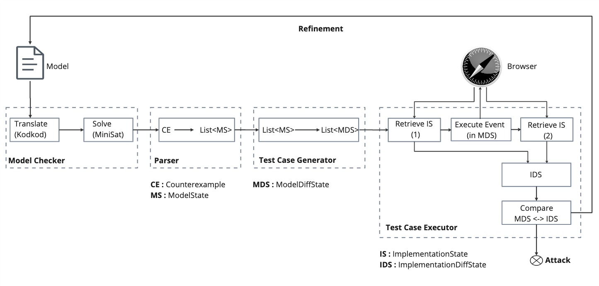

# Model Evaluator Framework

Model Evaluator is a tool that automatically:
-	analyses formal models for browsers written in Alloy, 
-	creates test cases from counterexamples(if any) found in model checking,
-	and creates test cases using an automated browser testing platform e.g., Browserstack.

## System Components

The Model Evaluator is a Java application and the components depicted in the image below. 


## Build and Run the Application

In order to build and run the application a JDK should be installed on the computer and mvn should be available on the terminal.

```
brew install maven

```

For building the framework, go to the application directory 'framework' and run:
```
mvn clean compile assembly:single

```
## Run the application:

For running the framework: we splitted the model checking and validation parts.
They should be executed seperately.
#### For running the framework: for model checking, 
an example is ::
```
java -jar target/model*.jar modelcheck M_cam/test.als cameraAttack 100 0 1

```
where:

The "modelcheck" argument is for choosing the model checking part in the framework.

The "M_cam/test.als" : shows the model directory (M_cam) and the root model file (test.als).

The "cameraAttack" : shows the property to be checked.

The fourth argument "100" : shows the number of instances to be generated.

The fifth argument "0" : indicates the decompose mode in model checking; 0 is batch, 1 is hybrid, 2 is parallel. 

The sixth argument "1" : indicates the number of threads; for batch strategy it should be 1; for other choices more than 1.

After model checking if a counterexample is found, a "trace.txt" file will be stored in the "input" folder in the directory. The solution instances (100) will be stored in "output" folder. The .xml files in this folder can be visualised with Alloy Analyzer tool.


#### For running the framework: for test case validation,
an example is :: 
```
java -jar target/model*.jar validate input/trace.txt

```
where:
The "validate" argument is for choosing the validation part in the framework.

The "input/trace.txt" argument shows the counterexample trace in the input directory (which was outputted by the model checker in the previous example). 

To run the validation, you need BrowserStack account. Then, you can run the application after replacing the following lines in the `framework/authentication.txt` file.
 ```
USERNAME
AUTOMATE_KEY

```


#### The model files are in the framework/models directory.

M_rfc : Safari browser RFC model

M_cam : Camera access model

M_sch : Side-channel access model


### The Model Evaluator framework is fully open-source and part of a research project, and it still is under development.
M_cam model currently includes a webcam attack on Safari, the attack trace can be found in https://www.ryanpickren.com/webcam-hacking.
See also 
-	Ilkan Esiyok https://cispa.de/en/people/ilkan.esiyok
-	Robert Kuennemann https://cispa.de/en/people/kuennemann/
-	Hamed Nemati https://cispa.de/en/people/hamed.nemati
for information about us.
